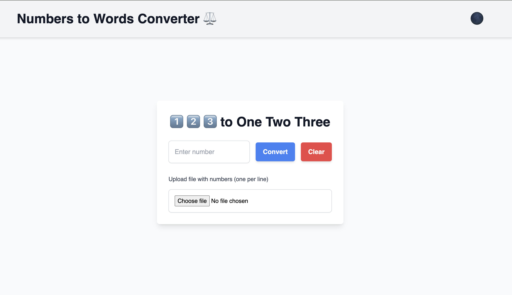

# 🌟 Numbers to Words Converter 🌟

## 📖 Description

Welcome to the **Numbers to Words Converter**! This sleek, responsive web app allows you to effortlessly convert numbers into their word representations. Whether you're converting small numbers or dealing with large amounts, this tool has you covered!

Enjoy the simplicity of the interface with automatic **light and dark mode toggling** & **file uploading** for batch conversion!🤩

## 🎯 Features

- 🔄 **Number to Words Conversion**: Enter any number, and the app will instantly convert it into words.
- 🎨 **Dark Mode / Light Mode Toggle**: Switch between dark and light modes effortlessly with an intuitive emoji-based toggle.
- 📂 **File Upload**: Upload a file with numbers (one per line), and get their word equivalents.
- 📝 **Copy to Clipboard**: Quickly copy the converted result to your clipboard with a single click.
- 🧹 **Clear Input**: Reset the input field and start fresh with a simple click.
- 💻 **Keyboard Shortcuts**: Press `Enter` to convert numbers for quicker input handling.
- 📱 **Fully Responsive**: Works perfectly on all screen sizes and devices, including mobile phones, tablets, and desktops.

## 🚀 How to Use

1. **Enter a Number**: Type any number into the input field.
2. **Convert**: Click the **Convert** button, or hit **Enter** on your keyboard to see the number in words.
3. **Copy**: After conversion, hit the **Copy** button to copy the word result to your clipboard.
4. **Clear**: Want to start over? Just hit the **Clear** button.
5. **File Upload**: Upload a file to convert multiple numbers at once. The app will display both the numbers and their word equivalents.

## 🎨 Dark/Light Mode Toggle

- Click the **🌑/🌕** button in the top-right corner to switch between dark and light mode.
- The theme is stored in your browser, so the app remembers your preference!

## 🛠️ Installation

1. **Clone this repository**:

    ```bash
    git clone https://github.com/Mishismail/numbers-to-words-converter.git
    ```

2. **Install the dependencies**:

    ```bash
    npm install
    ```

3. **Run the app locally**:

    ```bash
    npm run dev
    ```

4. Open your browser and go to:

    ```bash
    http://localhost:3000
    ```

5. **Enjoy the app!**

## 📁 File Structure

```bash
numbers-to-words-converter/
│
├── app/                   
│   ├── components/        
│   ├── layout.js          
│   └── page.js            
│
├── public/                
│
├── styles/                
│
├── README.md              
│
└── package.json
```
     
## 🛠️ Technologies Used

- **React.js**: For building the user interface
- **Next.js**: As the React framework
- **Tailwind CSS**: For modern, utility-first CSS
- **Number-to-Words**: Library for converting numbers to words
- **Emoji Toggle**: Custom emoji-based light/dark mode toggle

## 📸 Screenshots

### Light Mode:



### Dark Mode:


## 🚨 Contributing

You're welcome to improve this project! Here's how you can help:

1. **Fork the repository**
2. **Create a new branch** (`git checkout -b my-feature`)
3. **Commit your changes** (`git commit -am 'Add a feature'`)
4. **Push to the branch** (`git push origin my-feature`)
5. **Create a new Pull Request**

👨‍💻 **Made with love by Mish** 💙

If you like this project, feel free to **star** ⭐ it on GitHub and share it with others!

## 📄 License

This project is licensed under the MIT License - see the [LICENSE](LICENSE) file for details.
